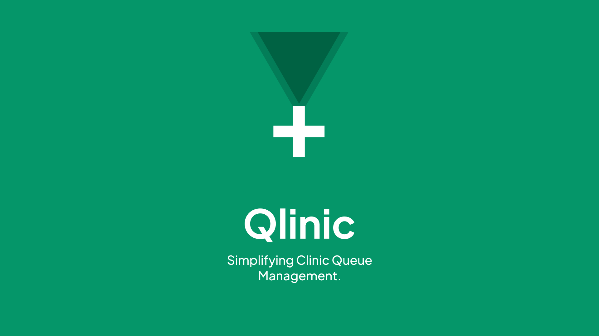
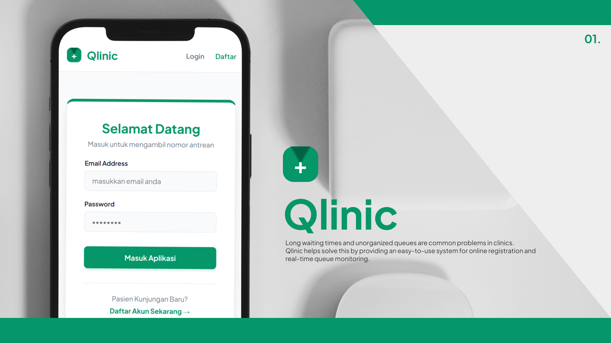
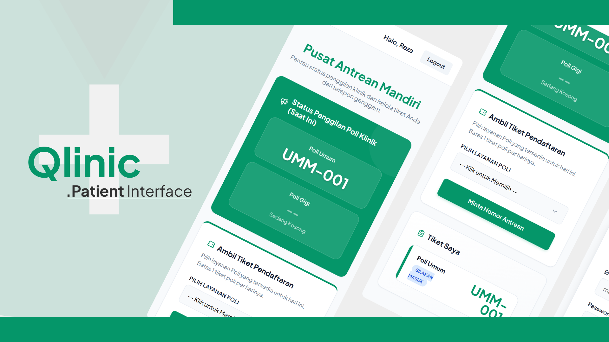
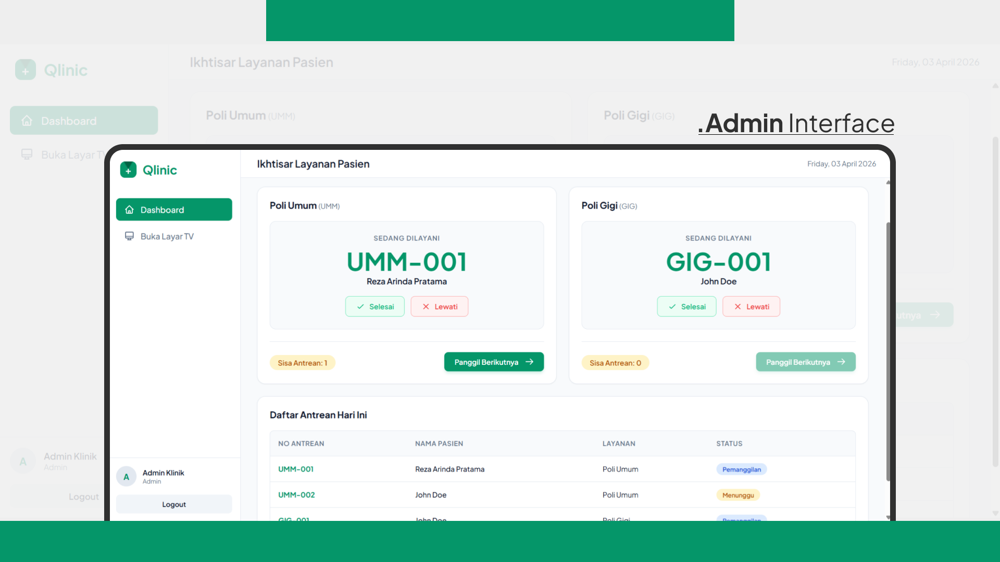
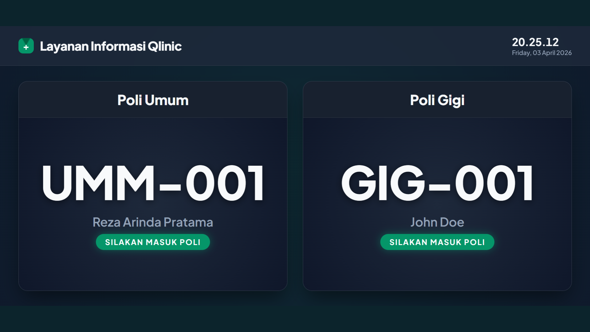

# 🏥 Qlinic - Sistem Antrian Klinik

<div align="center">
  
</div>
<div align="center">
  
</div>
<div align="center">
  
</div>
<div align="center">
  
</div>
<div align="center">
  
</div>

<br>

Qlinic adalah platform sistem antrian klinik modern yang dibangun menggunakan kerangka kerja **Laravel**. Aplikasi ini dirancang untuk memberikan pengalaman yang mulus dan efisien dalam pengelolaan antrian pasien, pendaftaran layanan kesehatan, serta pemantauan rekam medis secara terpusat.

Dengan Qlinic, manajemen klinik menjadi lebih terstruktur, waktu tunggu pasien berkurang, dan produktivitas staf medis meningkat! 🚀

---

## ✨ Fitur Utama

- **Pendaftaran Pasien Online:** Pasien dapat mengambil nomor antrian secara digital sebelum datang ke klinik.
- **Manajemen Poli & Layanan:** Mendukung banyak poliklinik dan jenis layanan dalam satu lokasi.
- **Live Queue Monitoring:** Tampilan antrian real-time yang bisa ditampilkan di layar TV ruang tunggu.
- **Rekam Medis (EMR) Terintegrasi:** Memudahkan dokter dalam melacak riwayat pasien.
- **Notifikasi Pintar:** Update status antrian pasien (segera hadir di versi selanjutnya).
- **Dashboard Analitik:** Ringkasan statistik jumlah kunjungan pasien per hari/bulan untuk manajemen klinik.

---

## 📸 Tangkapan Layar (Screenshots)

Berikut adalah beberapa tampilan antarmuka dari pengguna aplikasi Qlinic:

<div align="center">
    
    <br>
    
    <br>
    
    <br>
    
</div>

---

## 🛠️ Tech Stack yang Digunakan

| Teknologi     | Deskripsi                                 |
| ------------- | ----------------------------------------- |
| **Laravel**   | Backend Framework MVC utama               |
| **Vite**      | Build tool untuk asset front-end          |
| **Blade**     | Template engine dinamis                   |
| **MySQL / PostgreSQL**  | Database relasional         |

---

## 🚀 Cara Menjalankan Project (Local Development)

Ikuti langkah-langkah di bawah ini untuk menjalankan aplikasi Qlinic di mesin lokal Anda.

### Persyaratan Sistem
Pastikan Anda telah menginstal perangkat lunak berikut:
- **PHP** >= 8.1
- **Composer** (Dependency Manager untuk PHP)
- **Node.js & NPM** (Untuk kompilasi frontend via Vite)
- **Database Server** (MySQL/MariaDB atau PostgreSQL)

### Langkah-langkah Instalasi

1. **Clone Repository**
   ```bash
   git clone https://github.com/rezaarinda26/qlinic.git
   cd qlinic
   ```

2. **Install Dependensi Backend**
   ```bash
   composer install
   ```

3. **Install Dependensi Frontend**
   ```bash
   npm install
   ```

4. **Konfigurasi Environment**
   Salin file `.env.example` menjadi `.env`:
   ```bash
   cp .env.example .env
   ```
   **Sesuaikan konfigurasi database** di file `.env`:
   ```env
   DB_CONNECTION=mysql
   DB_HOST=127.0.0.1
   DB_PORT=3306
   DB_DATABASE=qlinic_db
   DB_USERNAME=root
   DB_PASSWORD=
   ```

5. **Generate Application Key**
   ```bash
   php artisan key:generate
   ```

6. **Migrasi dan Seeder Database**
   ```bash
   php artisan migrate --seed
   ```

7. **Jalankan Development Server**
   Buka dua jendela terminal terpisah dan jalankan perintah ini bersaman:
   
   Terminal 1 (Backend):
   ```bash
   php artisan serve
   ```
   Terminal 2 (Frontend):
   ```bash
   npm run dev
   ```

Aplikasi sekarang dapat diakses melalui `http://localhost:8000` 🎉

---

## 🤝 Kontribusi

Kami sangat menghargai kontribusi dari siapapun! Jika Anda menemukan bug atau memiliki ide fitur baru, silakan buat _Pull Request_ atau laporkan via _Issues_.

1. Fork repository ini
2. Buat branch fitur baru (`git checkout -b fitur/fitur-keren`)
3. Commit perubahan (`git commit -m 'Menambahkan fitur keren'`)
4. Push ke branch (`git push origin fitur/fitur-keren`)
5. Buka **Pull Request**

---

## 📄 Lisensi

Qlinic adalah perangkat lunak _open-source_ di bawah naungan lisensi [MIT license](https://opensource.org/licenses/MIT).

</br>

<div align="center">
  Dibuat dengan ❤️ untuk sistem pelayanan kesehatan yang lebih baik.
</div>
